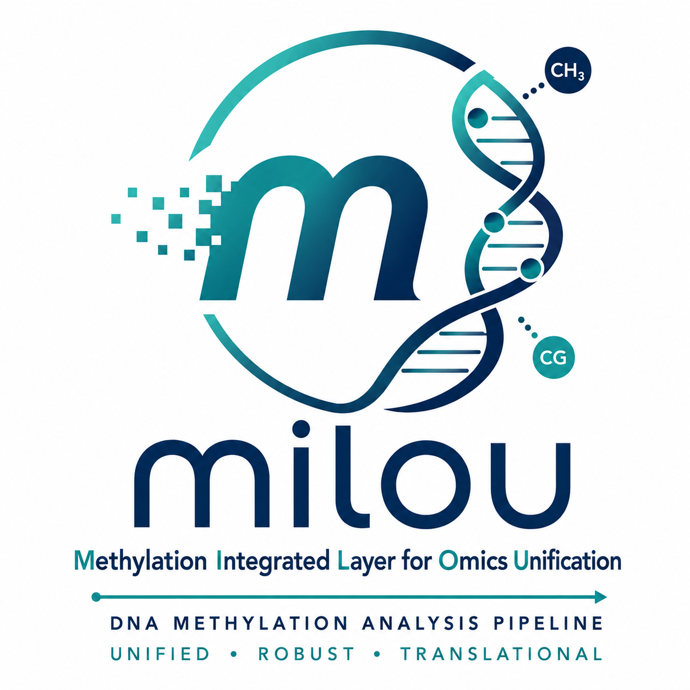

```{r setup}
library(glue)
library(knitr)
library(kableExtra)
library(jsonlite)

# Gracefully try to load DT and htmltools if available
has_dt <- requireNamespace("DT", quietly = TRUE) && requireNamespace("crosstalk", quietly = TRUE)
if (has_dt) {
  library(DT)
}
if (requireNamespace("htmltools", quietly = TRUE)) {
  library(htmltools)
}

# Robust error handling for file reading
read_tsv_safe <- function(file_path) {
  if(!is.null(file_path) && file.exists(file_path)) {
    if (grepl(".csv$", file_path)) {
        return(read.csv(file_path, stringsAsFactors = FALSE))
    } else {
        return(read.delim(file_path, sep="\t", stringsAsFactors = FALSE))
    }
  } else {
    return(data.frame())
  }
}

# Helper to find plots and filter out 0-byte or corrupted files
is_valid_png <- function(f) {
  if (!file.exists(f)) return(FALSE)
  sz <- file.info(f)$size
  if (is.na(sz) || sz < 100) return(FALSE)
  tryCatch({
    con <- file(f, "rb")
    magic <- readBin(con, "raw", 8)
    close(con)
    identical(as.raw(c(0x89, 0x50, 0x4e, 0x47, 0x0d, 0x0a, 0x1a, 0x0a)), magic)
  }, error = function(e) FALSE)
}

find_plot <- function(dir_path, suffix) {
    # 1. First check if the image is already present in current directory and is valid
    local_candidates <- list.files(".", pattern = suffix, full.names = FALSE)
    if (length(local_candidates) > 0) {
      valid_local <- local_candidates[sapply(local_candidates, is_valid_png)]
      if (length(valid_local) > 0) {
        return(valid_local[1])
      }
    }
    
    # 2. Search in dir_path if provided
    if (!is.null(dir_path) && dir.exists(dir_path)) {
      files <- list.files(dir_path, pattern = suffix, full.names = TRUE)
      if (length(files) > 0) {
        valid_files <- files[sapply(files, is_valid_png)]
        if (length(valid_files) > 0) {
          local_name <- basename(valid_files[1])
          # Prevent self-copy which truncates file to 0 bytes on Linux/POSIX
          if (normalizePath(valid_files[1], mustWork = FALSE) != normalizePath(local_name, mustWork = FALSE)) {
            file.copy(valid_files[1], local_name, overwrite = TRUE)
          }
          return(local_name)
        }
      }
    }
    NULL
}

# Helper to format p-values / FDR cleanly in scientific notation
format_p <- function(x) {
  num_x <- as.numeric(x)
  ifelse(is.na(num_x), "-", formatC(num_x, format = "e", digits = 2))
}

# Load data
meta <- read_tsv_safe(params$sample_metadata)
qc <- read_tsv_safe(params$qc_summary)
dmr <- read_tsv_safe(params$dmr_summary)
gene <- read_tsv_safe(params$gene_summary)
disease <- read_tsv_safe(params$disease_summary)
pathways <- read_tsv_safe(params$pathway_summary)
kegg <- read_tsv_safe(params$kegg_summary)

res_dir <- dirname(params$dmr_summary)
run_info <- if (file.exists(params$run_info)) fromJSON(params$run_info) else list()
software_versions <- if (!is.null(run_info$software_versions)) run_info$software_versions else list()

# Helper for HTML/LaTeX-safe tables with colored headers and full-width layout
kable_report <- function(df, caption = "", note = NULL, font_size = 9) {
  if (nrow(df) == 0) return(cat("No data available.\n"))
  
  if (knitr::is_html_output()) {
    colnames(df) <- gsub("\\.", " ", colnames(df))
    colnames(df) <- gsub("_", " ", colnames(df))
    kb <- kable(df, format = "html", caption = caption)
    kb <- kable_styling(kb, full_width = TRUE, 
                        bootstrap_options = c("striped", "hover", "condensed"))
    if (!is.null(note)) kb <- footnote(kb, general = note, general_title = "Note: ")
    return(kb)
  } else {
    colnames(df) <- gsub("\\.", " ", colnames(df))
    colnames(df) <- gsub("_", " ", colnames(df))
    colnames(df) <- gsub("%", "\\\\%", colnames(df))
    
    char_cols <- sapply(df, is.character)
    if (any(char_cols)) {
      df[char_cols] <- lapply(df[char_cols], function(x) {
        x <- gsub("_", "\\\\_", x)
        x <- gsub("%", "\\\\%", x)
        x
      })
    }
    
    kb <- kable(df, format = "latex", escape = FALSE, caption = caption, booktabs = TRUE, row.names = FALSE, longtable = FALSE)
    kb <- kable_styling(kb,
                  full_width = FALSE, 
                  latex_options = c("striped", "HOLD_position"),
                  font_size = font_size)
    kb <- row_spec(kb, 0, bold = TRUE, color = "white", background = "#00838F")
    if (!is.null(note)) {
      note_esc <- note
      note_esc <- gsub("10^-10", "$10^{-10}$", note_esc, fixed = TRUE)
      note_esc <- gsub("π", "$\\\\pi$", note_esc, fixed = TRUE)
      note_esc <- gsub("Δβ", "$\\\\Delta\\\\beta$", note_esc, fixed = TRUE)
      note_esc <- gsub("Δ", "$\\\\Delta$", note_esc, fixed = TRUE)
      note_esc <- gsub("β", "$\\\\beta$", note_esc, fixed = TRUE)
      note_esc <- gsub("∈", "$\\\\in$", note_esc, fixed = TRUE)
      note_esc <- gsub("≥", "$\\\\ge$ ", note_esc, fixed = TRUE)
      note_esc <- gsub("≤", "$\\\\le$ ", note_esc, fixed = TRUE)
      note_esc <- gsub("×", "$\\\\times$ ", note_esc, fixed = TRUE)
      note_esc <- gsub("%", "\\\\%", note_esc, fixed = TRUE)
      note_esc <- gsub("_", "\\\\_", note_esc, fixed = TRUE)
      kb <- footnote(kb, general = note_esc, general_title = "Note: ", threeparttable = TRUE, escape = FALSE)
    }
    # Transform standard tabular to full-width tabular*
    orig_attrs <- attributes(kb)
    kb_str <- as.character(kb)
    kb_str <- sub("\\\\begin\\{tabular\\}(\\[[^\\]]*\\])?\\{([^}]+)\\}",
                  "\\\\begin{tabular*}{\\\\linewidth}{@{\\\\extracolsep{\\\\fill}}\\2@{}}",
                  kb_str)
    kb_str <- sub("\\\\end\\{tabular\\}", "\\\\end{tabular*}", kb_str)
    attributes(kb_str) <- orig_attrs
    return(kb_str)
  }
}

n_samples <- nrow(meta)
n_dmrs <- nrow(dmr)
```

```{r header-box, results='asis'}
# Extract run metadata safely
r_name <- if (!is.null(run_info$run_name)) run_info$run_name else "milou_run"
r_date <- if (!is.null(run_info$timestamp)) substr(run_info$timestamp, 1, 10) else as.character(Sys.Date())
r_ver <- if (!is.null(run_info$version)) run_info$version else "1.2.0"
r_nf <- if (!is.null(run_info$nextflow_version)) run_info$nextflow_version else "25.10.2"
r_engine <- if (!is.null(run_info$container_engine)) run_info$container_engine else "singularity"
r_assay <- if (!is.null(run_info$resolved_params$assay_type)) toupper(run_info$resolved_params$assay_type) else "WGBS"
r_aligner <- if (!is.null(run_info$resolved_params$aligner)) run_info$resolved_params$aligner else "bismark"
r_genome_raw <- if (!is.null(run_info$genome_build)) basename(run_info$genome_build) else "GRCh38"
r_genome <- gsub("\\.dna\\.primary.*|\\.fa.*", "", r_genome_raw)

# Identify DMR callers
callers_vec <- c()
if ("Methods_Detected" %in% colnames(dmr)) {
  callers_vec <- unique(unlist(strsplit(as.character(dmr$Methods_Detected), "[, ]+")))
} else if ("Method" %in% colnames(gene)) {
  callers_vec <- unique(unlist(strsplit(as.character(gene$Method), "[, ]+")))
}
callers_vec <- callers_vec[callers_vec != "" & !is.na(callers_vec)]
r_callers <- if (length(callers_vec) > 0) paste(callers_vec, collapse = ", ") else "DSS"

r_comp <- if (!is.null(run_info$resolved_params$compare_str)) {
  gsub("_", " ", run_info$resolved_params$compare_str)
} else if (length(unique(meta$Group)) >= 2) {
  paste(unique(meta$Group), collapse = " vs. ")
} else {
  "Control vs. Treated"
}

if (knitr::is_html_output()) {
  cat('```{=html}\n')
  cat('<div class="report-header-banner">\n')
  cat('  <div style="display: flex; justify-content: space-between; align-items: center; border-bottom: 3px solid #00838F; padding-bottom: 12px; margin-bottom: 20px;">\n')
  cat('    <div>\n')
  cat('      <h2 style="margin: 0; color: #1F2D3D; font-weight: 700;">DNA Methylation Profiling Report</h2>\n')
  cat('      <div style="color: #00838F; font-size: 1.05rem; font-weight: 500;">High-Resolution Epigenomic Analysis & Prioritization</div>\n')
  cat('    </div>\n')
  cat('    <div>\n')
  cat('      \n')
  cat('    </div>\n')
  cat('  </div>\n')
  cat('  \n')
  cat('  <div class="metadata-grid">\n')
  cat('    <div>\n')
  cat('      <div class="metadata-item"><strong>Run Identifier:</strong> ', r_name, '</div>\n')
  cat('      <div class="metadata-item"><strong>Analysis Date:</strong> ', r_date, '</div>\n')
  cat('      <div class="metadata-item"><strong>Pipeline:</strong> milou v', r_ver, '</div>\n')
  cat('      <div class="metadata-item"><strong>Run Engine:</strong> Nextflow ', r_nf, '</div>\n')
  cat('      <div class="metadata-item"><strong>Execution Environment:</strong> ', r_engine, '</div>\n')
  cat('    </div>\n')
  cat('    <div>\n')
  cat('      <div class="metadata-item"><strong>Reference Genome:</strong> ', r_genome, '</div>\n')
  cat('      <div class="metadata-item"><strong>Assay Modality:</strong> ', r_assay, ' (Aligner: ', r_aligner, ')</div>\n')
  cat('      <div class="metadata-item"><strong>DMR Callers:</strong> ', r_callers, '</div>\n')
  cat('      <div class="metadata-item"><strong>Cohort Size:</strong> ', n_samples, ' Samples</div>\n')
  cat('      <div class="metadata-item"><strong>Comparison Groups:</strong> ', r_comp, '</div>\n')
  cat('    </div>\n')
  cat('  </div>\n')
  cat('</div>\n')
  cat('```\n')
} else {
  r_name_esc <- gsub("_", "\\\\_", r_name)
  r_genome_esc <- gsub("_", "\\\\_", r_genome)
  r_assay_esc <- gsub("_", "\\\\_", r_assay)
  r_aligner_esc <- gsub("_", "\\\\_", r_aligner)
  r_engine_esc <- gsub("_", "\\\\_", r_engine)
  r_callers_esc <- gsub("_", "\\\\_", r_callers)
  r_comp_esc <- gsub("_", "\\\\_", r_comp)
  
  cat('\\noindent\n')
  cat('\\begin{metadatabox}\n')
  cat('\\begin{tabular*}{\\textwidth}{@{\\extracolsep{\\fill}}ll@{}}\n')
  cat('\\textbf{Run Identifier:} ', r_name_esc, ' & \\textbf{Reference Genome:} ', r_genome_esc, ' \\\\\n')
  cat('\\textbf{Analysis Date:} ', r_date, ' & \\textbf{Assay Modality:} ', r_assay_esc, ' (Aligner: ', r_aligner_esc, ') \\\\\n')
  cat('\\textbf{Pipeline:} milou v', r_ver, ' & \\textbf{DMR Callers:} ', r_callers_esc, ' \\\\\n')
  cat('\\textbf{Run Engine:} Nextflow ', r_nf, ' & \\textbf{Cohort Size:} ', n_samples, ' Samples \\\\\n')
  cat('\\textbf{Execution Environment:} ', r_engine_esc, ' & \\textbf{Comparison Groups:} ', r_comp_esc, ' \\\\\n')
  cat('\\end{tabular*}\n')
  cat('\\end{metadatabox}\n')
  cat('\\vspace{-2mm}\n')
}
```

# Executive Summary

```{r summary-stats, results='asis'}
if(n_samples > 0) {
    cat(glue("This report summarizes comprehensive DNA methylation analysis across **{n_samples} cohort samples**. All quality control parameters were evaluated against benchmark standards for bisulfite/enzymatic sequencing. A total of **{n_dmrs} differentially methylated regions (DMRs)** were detected. Each region has been cross-referenced with functional genomic annotations and disease database associations.\n\n"))
}

if(nrow(disease) > 0 && !"Message" %in% colnames(disease)) {
    cat(glue("Top disease associations detected: **{paste(head(disease$Description, 5), collapse = ', ')}**.\n\n"))
}

# Dynamic Biological Interpretation Note from run_info narrative
narrative_field <- grep("narrative", names(run_info), value = TRUE)[1]
narrative_text <- if(!is.na(narrative_field)) run_info[[narrative_field]] else NULL
if(!is.null(narrative_text) && narrative_text != "") {
    # Strip any trailing clinical correlation sentence if present
    narrative_text <- gsub("The epigenetic profile in these regions warrants [^.]*\\.?\\s*", "", narrative_text)
    narrative_text <- trimws(narrative_text)
    if (nchar(narrative_text) > 0) {
        if (knitr::is_html_output()) {
            cat('<div class="report-card" style="border-left-color: #00838F; margin-top: 15px;">\n')
            cat('<strong style="color: #00838F;">Biological Interpretation Note:</strong> ', narrative_text, '\n')
            cat('</div>\n\n')
        } else {
            cat('\\vspace{2mm}\n')
            cat('\\begin{reportnote}[title=\\textbf{Biological Interpretation Note}]\n')
            cat(narrative_text, '\n')
            cat('\\end{reportnote}\n\n')
        }
    }
}
```

# Quality Control & Sample Status

The following metrics summarize sequencing throughput, alignment efficiency, PCR duplication, and bisulfite/EM-seq conversion rates across all cohort samples.

```{r qc-table, results='asis'}
if (nrow(qc) > 0) {
  qc_display <- qc
  colnames(qc_display) <- gsub("Specimen", "Sample", colnames(qc_display))
  colnames(qc_display) <- gsub("[._]", " ", colnames(qc_display))
  
  print(kable_report(qc_display, 
               caption = "Sequencing and Alignment Quality Control for Cohort Samples",
               note = "Sample = cohort sample identifier; Group = experimental condition (Control vs Treated); Mean Coverage = mean read depth across target CpG loci; Targets 30x = percentage of target loci covered at ≥30× depth; Median Insert Size = paired-end library insert length in base pairs (bp); Mapping = percentage of quality-trimmed reads uniquely aligned to reference genome.",
               font_size = 9))
} else {
  cat("No QC data available for this run.\n")
}
```

```{r qc-pca, results='asis'}
pca_img <- find_plot(res_dir, ".*pca_plot\\.png$")
if (!is.null(pca_img)) {
    cat("\n\n### Cohort Sample Clustering (PCA)\n")
    cat(glue("{{width=70% fig-pos='H'}}\n\n"))
}
```

\newpage

# Differentially Methylated Regions (DMRs)

```{r dmr-desc, results='asis'}
callers_str <- if (length(callers_vec) > 0) paste(callers_vec, collapse = ", ") else "the consensus pipeline"
if ("DSS" %in% callers_vec && length(callers_vec) == 1) {
  framework_desc <- "Differential methylation was identified using the **DSS (Dispersion Shrinkage for Sequencing)** framework, which fits a beta-binomial hierarchical model with dispersion shrinkage to account for biological variation and read depth."
} else if ("methylKit" %in% callers_vec && length(callers_vec) == 1) {
  framework_desc <- "Differential methylation was identified using the **methylKit** framework, applying logistic regression and sliding tiling windows across CpG loci."
} else if ("edgeR" %in% callers_vec && length(callers_vec) == 1) {
  framework_desc <- "Differential methylation was identified using **edgeR**, utilizing empirical Bayes negative binomial generalized linear models."
} else {
  framework_desc <- glue("Differential methylation was evaluated using an integrated consensus ensemble ({callers_str}), combining beta-binomial dispersion modeling (DSS) and logistic regression/sliding windows (methylKit) to provide cross-validated epigenetic discovery.")
}
cat(glue("Differentially Methylated Regions (DMRs) represent contiguous genomic loci where DNA methylation levels deviate significantly between experimental groups. {framework_desc}\n\n"))
```

## Significant DMR Candidates

```{r dmr-table, results='asis'}
if(n_dmrs > 0) {
    dmr_top <- if (nrow(dmr) > 0) head(dmr[order(dmr$Min_pvalue), ], 20) else dmr
    
    # Format numeric columns cleanly
    if ("Min_pvalue" %in% colnames(dmr_top)) {
      dmr_top$Min_pvalue <- format_p(dmr_top$Min_pvalue)
    }
    if ("Mean_log2FC" %in% colnames(dmr_top)) {
      dmr_top$diff <- round(as.numeric(dmr_top$Mean_log2FC), 3)
      dmr_top$Mean_log2FC <- NULL
    }
    if ("Distance" %in% colnames(dmr_top)) {
      dist_num <- round(as.numeric(dmr_top$Distance))
      dmr_top$Distance <- ifelse(is.na(dist_num), "-",
                                 paste0(ifelse(dist_num > 0, "+", ""), format(dist_num, big.mark = ","), " bp"))
    }
    
    cols_order <- intersect(c("gene", "Methods_Detected", "diff", "Min_pvalue", "Distance", "Region"), colnames(dmr_top))
    if (length(cols_order) > 0) dmr_top <- dmr_top[, cols_order, drop = FALSE]
    colnames(dmr_top)[colnames(dmr_top) == "gene"] <- "Symbol"
    colnames(dmr_top)[colnames(dmr_top) == "Min_pvalue"] <- "Min p-value"
    colnames(dmr_top)[colnames(dmr_top) == "diff"] <- "Diff (Δβ)"
    
    print(kable_report(dmr_top, 
                 caption = "Top 20 Most Significant Differentially Methylated Regions",
                 note = "Symbol = nearest annotated HUGO gene symbol; Methods Detected = statistical algorithms identifying DMR; Diff (Δβ) = standardized methylation difference (Δβ ∈ [-1, 1]); Min p-value = minimum significance across callers; Distance = genomic distance in base pairs (bp) from DMR center to the gene Transcription Start Site (TSS); Region = regional genomic annotation.",
                 font_size = 8.5))
    
    dmr_detail_img <- find_plot(res_dir, ".*top_dmr_detail_plot\\.png$")
    if (!is.null(dmr_detail_img)) {
        cat("\n\n### Representative DMR Methylation Profile\n")
        cat(glue("{{width=80% fig-pos='H'}}\n\n"))
    }
} else {
    cat("No significant DMRs were detected under the specified significance thresholds.\n")
}
```

\newpage

# Functional Gene Annotation & Prioritization

To prioritize candidates with direct functional relevance, DMRs are mapped to proximal gene features (Promoters, Enhancers, or Gene Bodies) and ranked via the cross-caller $\pi$-score prioritization metric\textsuperscript{1, 2, 3}:

$$ \pi\text{-score} = \overline{|\Delta\beta|} \times -\log_{10}(\text{FDR} + 10^{-10}) $$

where $\overline{|\Delta\beta|} \in [0, 1]$ represents the harmonized mean biological methylation proportion difference and $\text{FDR}$ is the minimum Benjamini–Hochberg adjusted significance across callers.

```{r norm-note, results='asis'}
if (knitr::is_html_output()) {
  cat('<div class="report-card">\n')
  cat('<strong style="color: #00838F;">Cross-Caller Normalization Note:</strong> methylKit outputs methylation differences on a percentage scale (-100% to +100%). To harmonize with callers using proportion values (such as DSS, Δβ ∈ [-1, 1]) and eliminate caller scale bias, methylKit values are standardized by dividing by 100 (Δβ = meth.diff/100). The aggregate π-score is computed on this unified proportion scale, ensuring consistent candidate ranking across all callers.\n')
  cat('</div>\n\n')
} else {
  cat('\\vspace{1mm}\n')
  cat('\\begin{reportnote}[title=\\textbf{Cross-Caller Normalization Note}]\n')
  cat('\\textbf{Cross-Caller Normalization Note:} methylKit reports methylation differences on a percentage scale ($-100\\%$ to $+100\\%$). To harmonize with callers using proportion values (such as DSS, $\\Delta\\beta \\in [-1, 1]$) and eliminate caller scale bias, methylKit values are standardized by dividing by 100 ($\\Delta\\beta = \\text{meth.diff}/100$). The aggregate $\\pi$-score is computed on this unified proportion scale, ensuring consistent candidate ranking across all callers.\n')
  cat('\\end{reportnote}\n')
  cat('\\vspace{1mm}\n\n')
}
```

## Prioritized Candidate Features

```{r genes-table, results='asis'}
if (nrow(gene) > 0) {
  top_genes <- gene
  if ("fdr" %in% colnames(top_genes)) {
      top_genes$fdr <- format_p(top_genes$fdr)
  }
  if ("Rank_Score" %in% colnames(top_genes) && !"pi_score" %in% colnames(top_genes)) {
      top_genes$pi_score <- round(as.numeric(top_genes$Rank_Score), 2)
  }
  if ("diff" %in% colnames(top_genes)) {
      top_genes$diff <- round(as.numeric(top_genes$diff), 3)
  }
  cols_to_keep <- c("Symbol", "Region", "diff", "fdr", "pi_score", "Method")
  cols_present <- intersect(cols_to_keep, colnames(top_genes))
  top_genes <- head(top_genes[, cols_present, drop = FALSE], 15)
  if ("pi_score" %in% colnames(top_genes)) {
      colnames(top_genes)[colnames(top_genes) == "pi_score"] <- "π-Score"
  }
  if ("diff" %in% colnames(top_genes)) {
      colnames(top_genes)[colnames(top_genes) == "diff"] <- "Diff (Δβ)"
  }
  
  print(kable_report(top_genes, 
               caption = "Top 15 Candidate Features Prioritized by Epigenetic Significance",
               note = "Symbol = HUGO gene symbol; Region = genomic context; Diff (Δβ) = standardized methylation proportion difference (Δβ ∈ [-1, 1]); fdr = minimum adjusted p-value across callers; π-Score = aggregate multi-method prioritization score (π = |Δβ| × -log10(FDR + 10^-10)); Method = callers identifying candidate.",
               font_size = 8.5))
} else {
  cat("No gene annotations found matching significant DMRs.\n")
}
```

\vfill
\noindent\rule{\textwidth}{0.4pt}

\vspace{1.5mm}
\noindent{\footnotesize \textsuperscript{1}Xiao et al., \textit{Bioinformatics} 30(24):3507–3514 (2014); \textsuperscript{2}Du et al., \textit{BMC Bioinformatics} 11:587 (2010); \textsuperscript{3}Wreczycka et al., \textit{J Biotechnol} 261:105–115 (2017).}

\newpage

# Pathway & Functional Interpretation

Functional enrichment identifies biological pathways over-represented among prioritized genes, providing a systems-level view of epigenetic regulation.

## GO Biological Process Enrichment

```{r go-results, results='asis'}
if(nrow(pathways) > 0 && !"Message" %in% colnames(pathways)) {
  top_pathways <- pathways[order(pathways$pvalue), ]
  
  padj_col <- if ("p.adjust" %in% colnames(top_pathways)) "p.adjust" else "pvalue"
  top_pathways$Score <- round(-log10(as.numeric(top_pathways[[padj_col]]) + 1e-10), 2)
  
  top_pathways$pvalue <- format_p(top_pathways$pvalue)
  top_pathways$p.adjust <- format_p(top_pathways[[padj_col]])
  
  colnames(top_pathways)[colnames(top_pathways) == "Score"] <- "Enrichment Score"
  
  cols <- c("ID", "Description", "pvalue", "p.adjust", "Enrichment Score")
  cols_present <- intersect(cols, colnames(top_pathways))
  top_pathways_sub <- head(top_pathways[, cols_present, drop = FALSE], 10)
  
  print(kable_report(top_pathways_sub, 
               caption = "Top 10 GO Biological Process Enrichment Terms",
               note = "ID = Gene Ontology accession; Description = biological process name; pvalue = nominal hypergeometric p-value; p.adjust = Benjamini–Hochberg FDR; Enrichment Score = -log10(FDR) statistical enrichment magnitude.",
               font_size = 8.5))
  
  go_plot <- find_plot(res_dir, ".*_go_barplot\\.png$")
  if (!is.null(go_plot)) {
      cat("\n\n### Functional Visualization (GO)\n\n")
      cat(glue("{{width=75% fig-pos='H'}}\n\n"))
  }
} else {
  cat("No significant GO biological process enrichment observed.\n")
}
```

## KEGG Pathway Summary

```{r kegg-results, results='asis'}
if(nrow(kegg) > 0 && !"Message" %in% colnames(kegg)) {
  top_kegg <- kegg[order(kegg$pvalue), ]
  padj_col <- if ("p.adjust" %in% colnames(top_kegg)) "p.adjust" else "pvalue"
  top_kegg$Score <- round(-log10(as.numeric(top_kegg[[padj_col]]) + 1e-10), 2)
  
  top_kegg$pvalue <- format_p(top_kegg$pvalue)
  top_kegg$p.adjust <- format_p(top_kegg[[padj_col]])
  
  colnames(top_kegg)[colnames(top_kegg) == "Score"] <- "Enrichment Score"
  
  cols <- c("ID", "Description", "pvalue", "p.adjust", "Enrichment Score")
  cols_present <- intersect(cols, colnames(top_kegg))
  top_kegg_sub <- head(top_kegg[, cols_present, drop = FALSE], 10)
  
  print(kable_report(top_kegg_sub, 
               caption = "Top 10 KEGG Molecular Pathway Enrichment Terms",
               note = "ID = KEGG pathway ID; Description = pathway name; pvalue = nominal p-value; p.adjust = Benjamini–Hochberg FDR; Enrichment Score = -log10(FDR) statistical enrichment magnitude.",
               font_size = 8.5))
  
  kegg_plot <- find_plot(res_dir, ".*_kegg_barplot\\.png$|.*_kegg_dotplot\\.png$")
  if (!is.null(kegg_plot)) {
      cat("\n\n### Pathway Visualization (KEGG)\n\n")
      cat(glue("{{width=75% fig-pos='H'}}\n\n"))
  }
  
  pathview_plot <- find_plot(res_dir, ".*pathview\\.png$")
  if (!is.null(pathview_plot)) {
      cat("\n\n### Molecular Pathway Diagram (Pathview)\n\n")
      cat(glue("{{width=95% fig-pos='H'}}\n\n"))
  }
} else {
  cat("No significant KEGG pathway enrichment observed.\n")
}
```

## Disease Ontology Analysis

```{r disease-results, results='asis'}
if(nrow(disease) > 0 && !"Message" %in% colnames(disease)) {
  top_disease <- disease[order(disease$pvalue), ]
  padj_col <- if ("p.adjust" %in% colnames(top_disease)) "p.adjust" else "pvalue"
  top_disease$Score <- round(-log10(as.numeric(top_disease[[padj_col]]) + 1e-10), 2)
  
  top_disease$pvalue <- format_p(top_disease$pvalue)
  top_disease$p.adjust <- format_p(top_disease[[padj_col]])
  colnames(top_disease)[colnames(top_disease) == "Score"] <- "Enrichment Score"
  
  cols <- c("ID", "Description", "pvalue", "p.adjust", "Enrichment Score")
  cols_present <- intersect(cols, colnames(top_disease))
  top_disease_sub <- head(top_disease[, cols_present, drop = FALSE], 10)
  
  print(kable_report(top_disease_sub, 
               caption = "Significant Disease-Gene Associations",
               note = "ID = Disease Ontology / DisGeNET ID; Description = disease condition; pvalue = nominal p-value; p.adjust = Benjamini–Hochberg FDR; Enrichment Score = -log10(FDR) statistical enrichment magnitude.",
               font_size = 8.5))
  
  dis_plot <- find_plot(res_dir, ".*_disease_barplot\\.png$|.*_disgenet_barplot\\.png$")
  if (!is.null(dis_plot)) {
      cat("\n\n### Disease Association Visualization\n\n")
      cat(glue("{{width=75% fig-pos='H'}}\n\n"))
  }
} else {
  cat("No significant Disease Ontology enrichment observed.\n")
}
```

\newpage

# Pipeline Traceability & Methods

```{r methods-block, results='asis'}
meth_desc <- if (!is.null(run_info$methods_description)) run_info$methods_description else ""
if (meth_desc != "") {
    m_text <- meth_desc
    m_text <- gsub("<h4>", "\n## ", m_text)
    m_text <- gsub("</h4>", "\n", m_text)
    m_text <- gsub("<p>", "\n\n", m_text)
    m_text <- gsub("</p>", "\n", m_text)
    m_text <- gsub("<li>", "\n* ", m_text)
    m_text <- gsub("</li>", "", m_text)
    m_text <- gsub("<strong>|<b>", "**", m_text)
    m_text <- gsub("</strong>|</b>", "**", m_text)
    m_text <- gsub("<em>|<i>", "*", m_text)
    m_text <- gsub("</em>|</i>", "*", m_text)
    m_text <- gsub("For more information.*", "", m_text)
    m_text <- gsub("<[^>]*>", "", m_text)
    
    m_lines <- trimws(unlist(strsplit(m_text, "\n")))
    meth_text <- paste(m_lines, collapse = "\n")
    meth_text <- gsub("\n{3,}", "\n\n", meth_text)
    cat(meth_text, "\n\n")
}
```

## Core Analytical Software Environment

```{r software-table, results='asis'}
if (length(software_versions) > 0) {
    sv_df <- data.frame(
        Tool = names(software_versions),
        Version = unlist(software_versions)
    )
    print(kable_report(sv_df, caption = "Analytical Software Traceability", note = "Software packages maintained in containerized environment.", font_size = 8.5))
}
```

## Appendix: Data Audit & Traceability

```{r audit-block, results='asis'}
run_name <- if (!is.null(run_info$run_name)) run_info$run_name else "milou_run"
run_version <- if (!is.null(run_info$version)) run_info$version else "1.2.0"
run_time <- if (!is.null(run_info$timestamp)) run_info$timestamp else Sys.time()
run_files <- if (!is.null(run_info$files_processed)) run_info$files_processed else 0
run_commit <- if (!is.null(run_info$commit_hash)) run_info$commit_hash else "Not available"
run_cmd <- if (!is.null(run_info$command_line)) run_info$command_line else "Not available"
run_nf <- if (!is.null(run_info$nextflow_version)) run_info$nextflow_version else "25.10.2"
run_ce <- if (!is.null(run_info$container_engine)) run_info$container_engine else "singularity"
run_genome <- if (!is.null(run_info$genome_build)) run_info$genome_build else "Homo_sapiens.GRCh38"

cat("### Pipeline Run Information\n\n")
cat(glue("- **Run Name:** {run_name}\n\n"))
cat(glue("- **Execution UUID:** UUID_PLACEHOLDER\n\n"))
cat(glue("- **Pipeline Version:** {run_version}\n\n"))
cat(glue("- **Nextflow Engine:** {run_nf}\n\n"))
cat(glue("- **Container Engine:** {run_ce}\n\n"))
if (knitr::is_html_output()) {
  cat(glue("- **Reference Genome:** `{run_genome}`\n\n"))
} else {
  cat(glue("- **Reference Genome:** \\path{{{run_genome}}}\n\n"))
}
cat(glue("- **Commit Hash:** {run_commit}\n\n"))
cat(glue("- **Command Line:** `{run_cmd}`\n\n"))
cat(glue("- **Timestamp:** {run_time}\n\n"))
cat(glue("- **Total Files Processed:** {run_files}\n\n"))

# Add Enrichment Parameters
if (!is.null(run_info$enrichment_params)) {
    e_p <- run_info$enrichment_params
    pv <- if (!is.null(e_p$pvalue_cutoff)) e_p$pvalue_cutoff else "0.01"
    lfc <- if (!is.null(e_p$logfc_cutoff)) e_p$logfc_cutoff else "1"
    top <- if (!is.null(e_p$top_n_genes)) e_p$top_n_genes else "100"

    cat("\n\n### Enrichment Cutoffs\n\n")
    cat(glue("- **P-value Threshold:** {pv}\n\n"))
    cat(glue("- **LogFC Threshold:** {lfc}\n\n"))
    cat(glue("- **Top Genes Prioritized:** {top}\n\n"))
}

if (!is.null(run_info$sanity_checks) && length(run_info$sanity_checks) > 0) {
    cat("\n\n### Output Sanity Checks\n\n")
    for (check in run_info$sanity_checks) {
        cat(glue("- {check}\n\n"))
    }
}

if (!is.null(run_info$checksums) && length(run_info$checksums) > 0) {
    cat("\n\n### Input Integrity (SHA256)\n\n")
    for (fname in names(run_info$checksums)) {
        cat(glue("- **{fname}**: `{run_info$checksums[[fname]]}`\n\n"))
    }
}

if (!is.null(run_info$resolved_params) && length(run_info$resolved_params) > 0) {
    cat("\n\n### Resolved Nextflow Parameters\n\n")
    cat("```json\n")
    cat(toJSON(run_info$resolved_params, pretty=TRUE, auto_unbox=TRUE))
    cat("\n```\n\n")
}
```

## Datapath Audit

Verification of input result paths used for this report generation.

```{r datapath-audit, results='asis'}
# Keep exact original paths per user specification
audit_items <- list(
    list("Samples", meta, params$sample_metadata),
    list("QC Summary", qc, params$qc_summary),
    list("DMRs", dmr, params$dmr_summary),
    list("Prioritized Genes", gene, params$gene_summary),
    list("GO Enrichment", pathways, params$pathway_summary),
    list("KEGG Enrichment", kegg, params$kegg_summary),
    list("Disease Enrichment", disease, params$disease_summary)
)

for (it in audit_items) {
    status <- if(nrow(it[[2]]) > 0) "SUCCESS" else "NO DATA"
    orig_path <- if (!is.null(it[[3]]) && it[[3]] != "") it[[3]] else "-"
    if (knitr::is_html_output()) {
        cat(glue("- **{it[[1]]}**: `{status}` ({nrow(it[[2]])} records) \n    *(Source: `{orig_path}`)*\n\n"))
    } else {
        cat(glue("- **{it[[1]]}**: \\texttt{{{status}}} ({nrow(it[[2]])} records) \n    *(Source: \\path{{{orig_path}}})*\n\n"))
    }
}
```

```{r disclaimer, results='asis'}
disclaimer_text <- "Results presented in this report were generated automatically using the milou computational pipeline for research and secondary discovery purposes. Analytical findings, including candidate genomic regions and pathway associations, should be validated against orthogonal experimental assays (such as targeted bisulfite amplicon sequencing or pyrosequencing) and cross-referenced with primary quality metrics."

if (knitr::is_html_output()) {
  cat('<div class="report-card" style="border-left-color: #5A6B7C; font-size: 0.9rem; color: #555;">\n')
  cat('<strong>Disclaimer:</strong> ', disclaimer_text, '\n')
  cat('</div>\n')
  cat('<div class="report-card" style="height: 80px;">\n')
  cat('<strong>Notes:</strong>\n')
  cat('</div>\n')
  cat('<div style="text-align: center; color: #64748B; font-size: 0.85rem; margin-top: 15px; margin-bottom: 25px;">\n')
  cat('--- End of Report ---\n')
  cat('</div>\n')
} else {
  cat('\\vspace{2mm}\n')
  cat('\\begin{disclaimerbox}\n')
  cat('\\footnotesize ', disclaimer_text, '\n')
  cat('\\end{disclaimerbox}\n')
  cat('\\vspace{1.5mm}\n')
  cat('\\begin{tcolorbox}[colback=white,colframe=milouborder,boxrule=0.8pt,arc=2mm,title=\\textbf{Notes},fonttitle=\\bfseries\\color{milouslate},colbacktitle=miloulight,height=1.8cm]\n')
  cat('\\end{tcolorbox}\n')
  cat('\\vspace{1mm}\n')
  cat('\\noindent\\centerline{\\color{gray}\\footnotesize --- End of Report ---}\n')
  cat('\\label{LastPage}\n')
}
```
