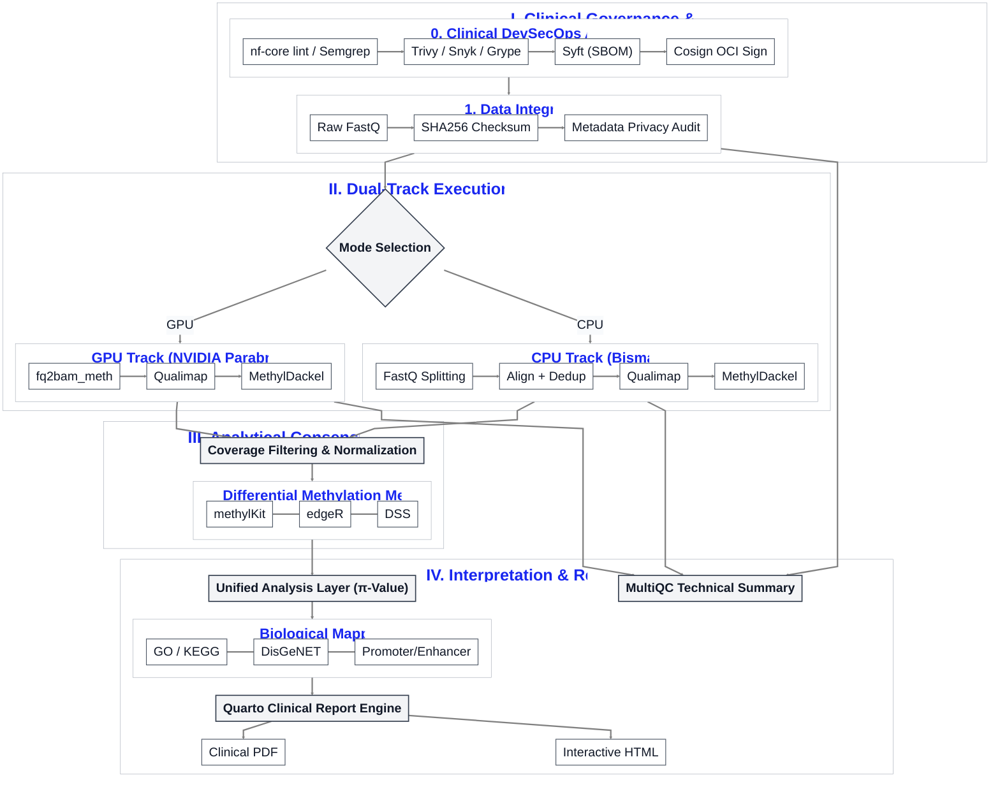

# milou Pipeline Architecture

This document contains the master architecture diagram for the **milou** pipeline. It is designed for use in manuscripts, documentation, and technical presentations.

## Master Clinical Architecture (Mermaid)

## Figure Legend (Manuscript Draft)

**Figure 1: The milou end-to-end clinical-grade DNA methylation orchestration.** 
(0) The pipeline utilizes an integrated 'nf-security-audit' suite (nf-core lint, Semgrep, Trivy, Snyk, Grype, Syft, and Cosign) for comprehensive static analysis, OCI vulnerability scanning, SBOM generation, and cryptographic signing. 
(1) All input data undergoes mandatory SHA256 integrity verification and privacy-aware metadata schema validation to ensure data de-identification and integrity. 
(2) Users can select between a high-speed GPU track (NVIDIA Parabricks) or a highly-optimized parallelized CPU track (Bismark). 
(3) Statistical analysis is performed across three independent mathematical frameworks (methylKit, edgeR, and DSS) to identify differentially methylated regions (DMRs). 
(4) A Unified Analysis Layer synthesizes results using a consensus scoring system, which is then mapped to biological pathways (GO/KEGG) and clinical disease descriptors (DisGeNET). 
(5) The final output is an automated, physician-ready clinical report generated via Quarto.
