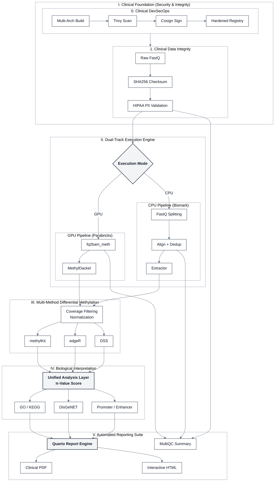

# MethylFlow Pipeline Architecture (Supplemental / Full Version)

This document contains the high-detail architecture diagram for the **MethylFlow** pipeline, suitable for Supplemental Information or technical posters.

## Detailed Clinical Architecture (Mermaid)

