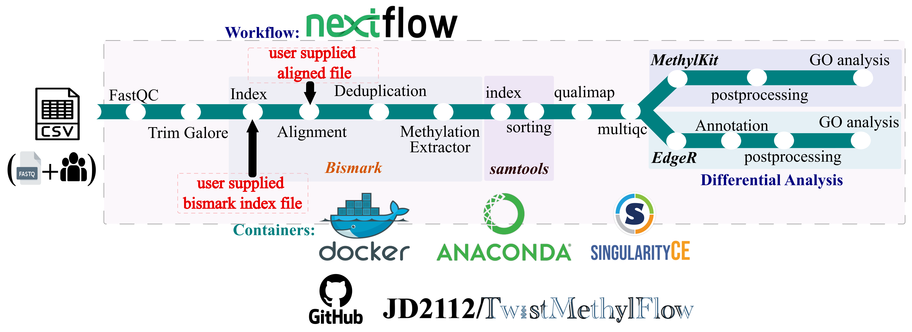

---
hide:
  - navigation
  - toc
---

# Introduction

[](https://doi.org/10.5281/zenodo.14204261)
[](https://jyotirmoys-organization.gitbook.io/MethylFlow)
[](https://github.com/JD2112/MethylFlow/actions/workflows/build-docs.yml)
[](https://github.com/JD2112/MethylFlow/settings/access)
[](https://wakatime.com/badge/user/fe95275f-909a-4147-a45d-624981173898/project/a44415f0-a274-4c3b-a59a-f8e1067c0fc1)

<div class="grid-container" markdown="1">

<div class="main-content" markdown="1">

**MethylFlow** is a robust, end-to-end Nextflow pipeline for comprehensive analysis of DNA methylation data. It streamlines the workflow from raw FASTQ files to structured outputs and **automated, publication-ready reports**.

The pipeline features a flexible dual-mode design:

- **Research mode** for rapid, exploratory analysis
- **Clinical-style mode** for structured, interpretation-oriented reporting

To support diverse computational environments, MethylFlow provides:

- ⚡ **GPU-accelerated execution** using NVIDIA Parabricks for fast turnaround
- 🧪 **CPU-based workflows** using Bismark for standard reproducible analysis

A unified results layer aggregates differential methylation, functional enrichment (e.g., GO/KEGG), and downstream summaries into harmonized outputs, enabling consistent reporting and interpretation.

???+ danger "Research Use Only (RUO)"

    This pipeline is intended for **Research Use Only (RUO)**. It has not been clinically validated and is not approved for diagnostic use. The generated reports are designed to support data interpretation and hypothesis generation, and must not be used for medical decision-making.



## 🚀 Key Features

- 🧬 **End-to-End Methylation Analysis**
  Complete workflow from raw FASTQ files to differential methylation, functional enrichment (GO/KEGG), and integrated downstream interpretation.

- ⚡ **Dual Execution Engine (GPU + CPU)**
  Flexible support for high-speed **GPU-accelerated processing** (NVIDIA Parabricks) and standard **CPU-based workflows** (Bismark), enabling both rapid turnaround and reproducible analysis.

- 🔀 **Dual-Mode Reporting (Research vs Clinical-Style)**
  A unique reporting framework that supports:
  
    - **Research mode** for fast, exploratory analysis
    - **Clinical-style mode** for structured, interpretation-oriented outputs with prioritized results and summaries

- 📊 **Unified Analysis Layer**
  Harmonizes outputs across modules into standardized result tables, integrating:
  
    - Differentially methylated regions (DMRs)
  - Gene-level summaries
  - Functional enrichment (GO/KEGG)
  - Disease association layers

- 🧠 **Integrated Biological Interpretation**
  Built-in annotation modules connect methylation changes to biological pathways and disease-relevant genes, facilitating downstream interpretation without manual integration.

- 📄 **Automated, Publication-Ready Reports**
  Generates clean, structured reports (PDF/HTML) via Quarto, combining statistical results with narrative summaries for easy interpretation and sharing.

- 🔁 **Reproducible & Scalable Architecture**
  Built with Nextflow DSL2 and containerized environments, ensuring portability across HPC, cloud, and local systems with consistent results.

- ⚙️ **One-Command Execution with Configurable Profiles**
  Simple execution with predefined profiles for:
  
    - test datasets (quick validation)
    - full-scale analysis
    - GPU-enabled runs

- 🧪 **Built-in Case Study & Reproducibility Support**
  
  Includes configurations to reproduce published datasets, enabling validation and benchmarking of the workflow.

- 🛡️ **Clinical-Grade Data Integrity & Determinism**
  
    - **SHA256 Verification**: Automatic cryptographic checksumming of input FASTQ files to detect data corruption.
    - **Bitwise Determinism**: Fixed random seeds (`set.seed(42)`) across all statistical modules for bit-identical results.
    - **HIPAA-Compliant Validation**: Strict schema enforcement to prevent Patient Identifiable Information (PII) in sample IDs.
    - **Automated Sanity Checks**: Real-time validation of coverage and mapping rates with high-visibility warnings.

## 📊 Pipeline Capabilities

| Category            | Feature                                                       | Status |
| :------------------ | :------------------------------------------------------------ | :----: |
| **Core Processing** | Dual-track Processing (GPU-Accelerated / CPU-Standard)        |   ✅   |
|                     | Multi-method Differential Methylation (DSS, edgeR, methylKit) |   ✅   |
| **Enrichment**      | Functional Annotation (GO / KEGG Pathway)                     |   ✅   |
|                     | Disease Association Layer (DisGeNET)                          |   ✅   |
| **Analysis**        | Unified Analysis Layer (Integrated Structured Outputs)        |   ✅   |
|                     | Gene Prioritization (Significance + Effect Size Scoring)      |   ✅   |
| **Reporting**       | Automated PDF/HTML Integrated Research Reports                |   ✅   |
|                     | Technical MultiQC Reporting                                   |   ✅   |
| **Review Layer**    | Integrated Region Annotation (Promoter/Enhancer/Distal)       |   ✅   |
|                     | Clinical-Style Review Mode (`--mode clinical`)                |   ✅   |
| **Clinical Rigor**  | Data Integrity (Input SHA256 Checksumming)                    |   ✅   |
|                     | Bitwise Determinism (Enforced Random Seeds)                   |   ✅   |
|                     | Automated Output Sanity Validation (Pass/Fail Checks)          |   ✅   |
|                     | HIPAA-Compliant Schema Enforcement                            |   ✅   |
| **Infrastructure**  | Containerized (Singularity, Docker, Conda)                    |   ✅   |
|                     | Reproducible DSL2 Modular Architecture                        |   ✅   |

## Usage

Sample sheet (CSV format) with sample information `Sample_sheet.csv`:

```bash
sample_id,group,read1,read2
SN09,Healthy,SN09_R1_001.fastq.gz,SN09_R2_001.fastq.gz
SN10,Disease,SN10_R1_001.fastq.gz,SN10_R2_001.fastq.gz
```

Each row represents a pair of fastq files (paired end).

???+ tip "Sample Information"
     **PLEASE NOTE:** minimum 3 samples per group are required to run the differential methylation analysis.

Now run the pipeline using:

```bash
nextflow run JD2112/MethylFlow \
    -profile singularity,gpu \
    --sample_sheet Sample_sheet_twist.csv \
    --genome_fasta path/to/genome.fa \
    --diff_meth_method dss,edger \
    --gtf_file /data/Homo_sapiens.GRCh38.104.gtf \
    --refseq_file /data/hg38_RefSeq.bed.gz \
    --outdir Results/MethylFlow_GPU
```

???+ warning "pipeline run" 
    1. Running on NVIDIA GPUs with CUDA will reduce the time significantly, but if not available, runs on cpu using bismark -

    ```bash
    nextflow run JD2112/MethylFlow \
    -profile singularity \
    --sample_sheet Sample_sheet_twist.csv \
    --genome_fasta path/to/genome.fa \
    --diff_meth_method dss,edger \
    --gtf_file /data/Homo_sapiens.GRCh38.104.gtf \
    --refseq_file /data/hg38_RefSeq.bed.gz \
    --outdir Results/MethylFlow_CPU
    ```
    2. Consider to check the pipeline parameters before running. You can change it via `conf/params.config`

For more details and further functionality, please refer to the [usage documentation](usage.md) and the [parameter documentation](parameters.md).

## Pipeline Output

MethylFlow generates a comprehensive `results/` folder including:

- **MultiQC Report**: Combined stats for all QC and alignment steps.
- **Clinical Research Report**: Automated PDF/HTML report (Quarto) containing physician-ready summaries of DMRs and pathways.
- **Unified Analysis Layer**: Integrated tables combining DMR statistics with GO, KEGG, and disease associations.
- **Visualizations**: Volcano plots, MA plots, dot plots, and GO/KEGG chord diagrams.

For more details about the output files and reports, please refer to the [output documentation](output.md).

## Benchmarking

Benchmarked on **hg38** (Human Genome) using 24 paired-end samples on the Dardel HPC and Fraka HPC.

| Feature             | CPU Track (Standard) | GPU Track (Parabricks)  |
| :------------------ | :------------------- | :---------------------- |
| **Indexing**        | Bismark Index        | BWA-meth Index          |
| **Alignment Speed** | 1.0x (Baseline)      | **~40x Faster**         |
| **Data Extraction** | Bismark Extractor    | MethylDackel            |
| **Hardware**        | 12+ CPU Cores        | NVIDIA GPU (16GB+ VRAM) |

## Credits

**MethylFlow** was originally written by **Jyotirmoy Das** ([@JD2112](https://github.com/JD2112)) at the Bioinformatics Unit, BKV, Linköping University to reduce the gap between the identification of methylation sites per sample and then perform the differential analysis separately.

Maintenace is now lead by Jyotirmoy Das.

Main developer:

- [Jyotirmoy Das](https://github.com/JD2112)

We thank the following people for their assistance in the development of this pipeline:

- [Debojyoti Das](https://github.com/biodebojyoti)

## Acknowledgements

We thank the **Core Facility of Linköping University** and **Clinical Genomics, Linköping, SciLifeLab** for support. Benchmarking was performed using resources provided by **PDC (KTH, Sweden)** and **Fraka (LiU)**.

## Citation

> Das, J. (2025). MethylFlow (v1.1.0). Zenodo. [https://doi.org/10.5281/zenodo.14204261](https://doi.org/10.5281/zenodo.14204261)

</div>

<div class="side-panel" markdown="1">


## Run with

[](https://www.nextflow.io/)
[](https://www.docker.com/)
[](https://apptainer.org/)
[](https://docs.conda.io/)

## Stats

<div class="stats-grid">
  <div class="stats-item"><span id="gh-stars" class="stats-value">--</span><span class="stats-label">stars</span></div>
  <div class="stats-item"><span id="gh-issues" class="stats-value">--</span><span class="stats-label">open issues</span></div>
  <div class="stats-item"><span id="gh-last-release" class="stats-value">--</span><span class="stats-label">last release</span></div>
  <div class="stats-item"><span id="gh-last-update" class="stats-value">--</span><span class="stats-label">last update</span></div>
</div>

## Included Tools

<div class="tag-section">
  <a href="https://www.bioinformatics.babraham.ac.uk/projects/fastqc/" target="_blank"><span>FastQC</span></a>
  <a href="https://www.bioinformatics.babraham.ac.uk/projects/trim_galore/" target="_blank"><span>Trim Galore!</span></a>
  <a href="https://www.bioinformatics.babraham.ac.uk/projects/bismark/" target="_blank"><span>Bismark</span></a>
  <a href="https://www.nvidia.com/en-us/clara/genomics/" target="_blank"><span>Parabricks</span></a>
  <a href="http://www.htslib.org/" target="_blank"><span>Samtools</span></a>
  <a href="http://qualimap.conesalab.org/" target="_blank"><span>Qualimap</span></a>
  <a href="https://github.com/dpryan79/MethylDackel" target="_blank"><span>MethylDackel</span></a>
  <a href="https://bioconductor.org/packages/release/bioc/html/edgeR.html" target="_blank"><span>EdgeR</span></a>
  <a href="https://bioconductor.org/packages/release/bioc/html/methylKit.html" target="_blank"><span>MethylKit</span></a>
  <a href="https://bioconductor.org/packages/release/bioc/html/clusterProfiler.html" target="_blank"><span>clusterProfiler</span></a>
  <a href="https://multiqc.info/" target="_blank"><span>MultiQC</span></a>
  <a href="https://ggplot2.tidyverse.org/" target="_blank"><span>ggplot2</span></a>
  <a href="https://quarto.org/" target="_blank"><span>Quarto</span></a>
</div>

## Contributors

<div id="gh-contributors" class="contrib-grid">
  <!-- Dynamically populated from GitHub API -->
</div>

## Get Help

- [Slack Community](https://nfcore.slack.com/channels/twistmethylflow)
- [GitHub Issues](https://github.com/JD2112/MethylFlow/issues)

</div>

</div>
